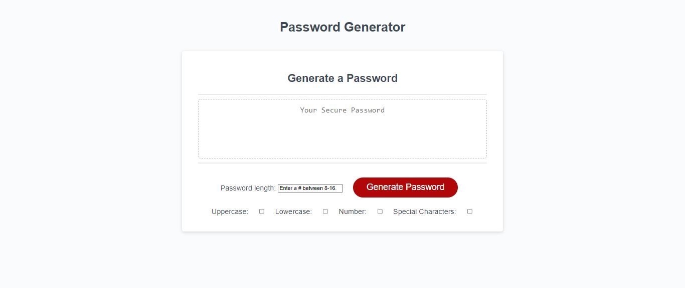

# Password Generator

            
## Link:
https://tschram93.github.io/password-generator/
## Description: 
This website application is used to create a unique password that is determined

## Instructions: 
First the user will enter a number between 8-16 into the password length input box. The user will then click at least one of checkboxes for the selections of `Uppercase`, `Lowercase`, `Number`, or `Special Characters.` After the user has completed checking boxes of desired characters and entering a number between 8-16 into the password length box, they will click the `Generate Password` button. The user will then be able copy the password that will be generated into the `Secure Password` box nd then paste/write it into their desired field.

## Dependencies
No dependencies are required for this application.

## Testing
There are no tests necessary for this application.

### License
There was not a licensed used for this application.

### Contact Information
* [Github](https://github.com/TSchram93)
* Email:  Tschram93@gmail.com
